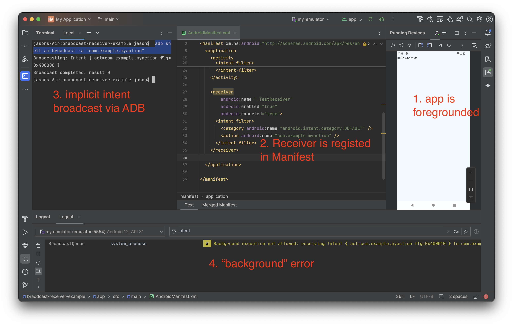

I am unable to receive broadcast intents when receiver is registered in the manifest, even when app is foregrounded.

1. Start with a new Gradle project
1. Add a single `BroadcastReceiver`
2. Register the receiver in `AndroidManifest.xml` with appropriate intent filter. Be sure to set `exported = true`
3. Deploy app to emulator
4. Bring app to the foreground
5. Broadcast an intent via `adb`

`$ adb shell am broadcast -a "com.example.myaction"`

[Docs](https://developer.android.com/develop/background-work/background-tasks/broadcasts#manifest-declared-receivers) makes it seem like this should work, but I get this error:


```
BroadcastQueue          
system_server
W
Background execution not allowed: receiving Intent { act=android.intent.action.DROPBOX_ENTRY_ADDED flg=0x10 (has extras) } to com.google.android.gms/.chimera.GmsIntentOperationService$PersistentTrustedReceiver
```

I already confirmed there are no user-initiated battery restrictions for this app on the emulator (I don't think those even apply when app is foregrounded)





For completeness, you can see this works fine if I make it an _explicit_ intent:

```
$  adb shell am broadcast -n com.example.myapplication/.TestReceiver -a "com.example.myaction"
```